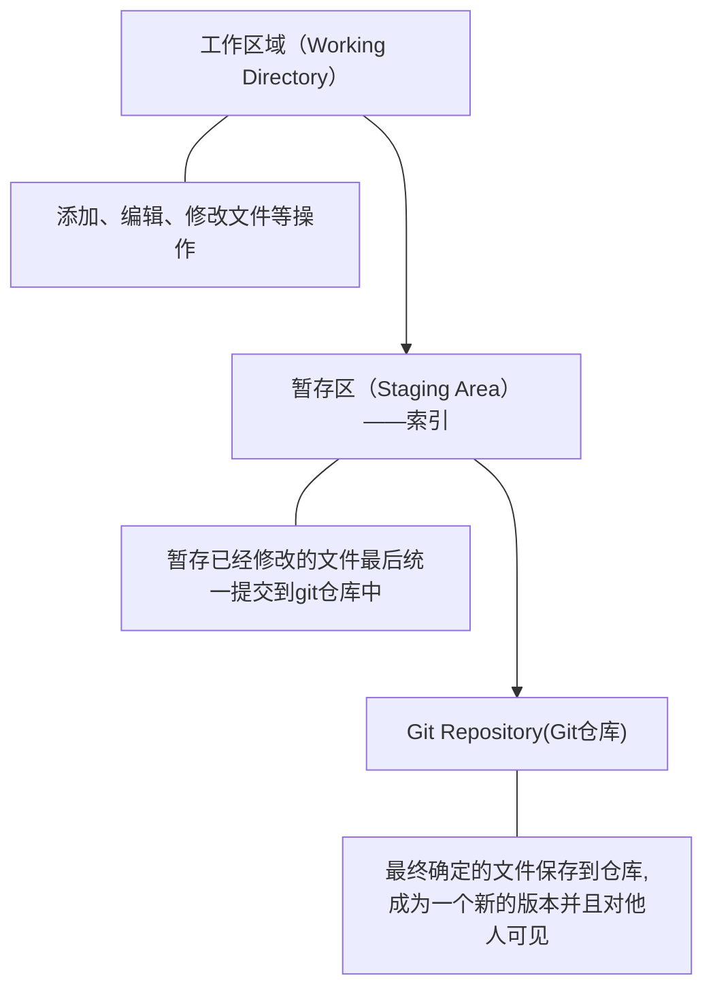
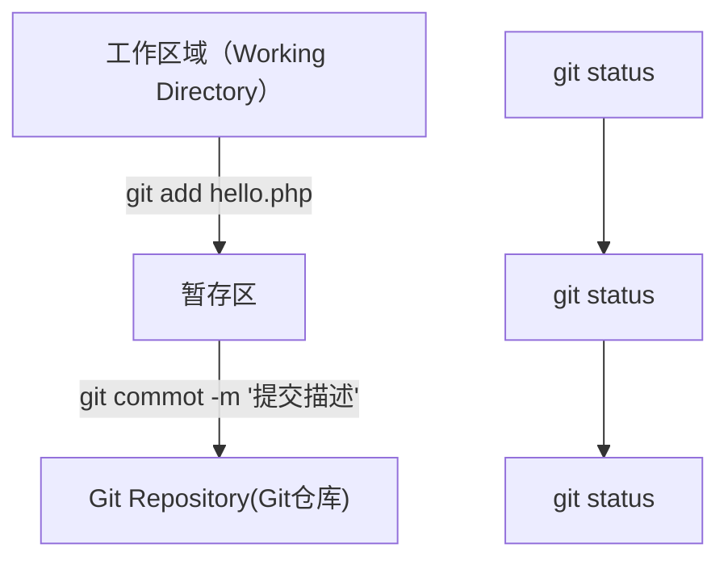

# Git

## 下载和安装

下载地址：https://git-scm.com/download/win

安装参考链接：自行搜索

## 工作流程

### Git工作区域





### 第一步 初始化基本信息

```python
#1.设置用户名
git config --global user.name 'itcast'

#2.设置用户名邮箱
git config --global user.name 'itcast@qq.com'

#3.查看设置
git config --list

  git config --global user.email "you@example.com"
  git config --global user.name "Your Name"


```

### 第二步 初始化一个新的Git仓库

1. 创建文件夹

   ```python
   mkdir test
   ```

   

2. 在文件夹创建git仓库

   ```python 
   cd test
   git init
   ```

   > 会生成**.git**文件如果看不见则设置电脑显示隐藏文件

3. 向仓库添加文件

   ```python
   touch a1.php
   
   git status
   
   #添加到暂存区
   git add a1.php
   
   git status
   
   #将文件从暂存区提交到仓库
   git commoy -m 'add a1.php'
   
   git status
   ```

4. 修改仓库文件

   ```python
   git add a1.php
   
   git status
   
   git commit -m 'edit a1.php'
   
   git status
   ```

   

5. 删除仓库文件

   ```python
   #删除文件
   rm test.php
   
   #从Git中删除文件
   git rm test.php
   
   #提交操作
   git commit -m '提交描述'
   ```

### 第三步 将本地仓库同步到git远程仓库

1. Git克隆操作

   ```python
   git clone 仓库地址
   ```

   多学一招：仓库地址由来，Clone to clipboard

2. 将本地仓库同步到git远程仓库中

   ```python
   git push
   ```

   注：思考无法同步

## 拉取远程仓库

```python
#1.查看所有远程仓库
git remote -v
#2.pull拉取是拉取加合并 pull = fetch + merge
git pull
#3.fetch拉取origin,master分支操作
git fetch origin master
git fetch origin main
#4.远程分支next要与当前分支合并
git pull origin next
#5.合并需要采用rebase模式
git pull --rebase origin master

```


## 分支

> 分支与分支之间相互独立，同时拥有自己的历史记录
>
> 分支的建立是在基于当前分支版本进行创建
>
> 新的分支的head指针指向当前最后一次提交

### 创建删除分支

```python
#1.建立 feature1 分支
git branch feature1
#2.查看分支
git branch
#查看远程分支
git branch -r
#3.切换分支到 feature1
git checkout feature1
#4.建立并切换分支到 feature3
git checkout -b feature3
#5.删除分支 feature1
git branch -d  feature1
#6.重命名分支
git branch -m old new
#7.强制重命名当前分支
git branch -M new
#8.删除远程分支名 feature1
git push origin :feature1
#9.将本地分支名 master 推送到远程分支 main
git push origin master:main
```

脚下留心：github使用main不是master，命令`git branch -M main`

### 合并分支

```python
#1.合并分支f1 fast-forward（快进）合并  默认--ff
git merge f1
#2.合并分支f1 并记录这次合并 --no-ff 
git merge f1 --no-ff
#3.重写项目历史，不会带来一次提交。但是会带来问题：提交记录省略
git rebase f1
#4.查看差异
git mergetool
```

脚下留心：

1. merge关注点：历史的提交记录。
2. merge是合并操作。
3. rebase关注点：项目过程发生了什么。
4. rebase是：将当前分支所做修改复制到，目标分支的最后一次提交上。
5. rebase的黄金法则是，绝对不要在公共分支上使用rebase。

## 日志

```python
git log
#一行展示
git --oneline
#一行展示 只看前3条
git --oneline -3
#展示某次版本的提交 版本号：8daf306
git show 8daf306
```


## 撤销

注：提交到远程仓库，不可逆。

### 1.撤销/丢弃最近修改

| 是否暂存区 | 是否远程仓库 | 命令                       | 描述                               |
| ---------- | ------------ | -------------------------- | ---------------------------------- |
| 否         | 否           | git checkout -- readme.txt | 撤销文件`readme.txt`修改           |
| 是         | 否           | git checkout -- readme.txt | 撤销修改就回到添加到暂存区后的状态 |

回到最近一次`git commit`或`git add`

```python
git checkout -- readme.txt
```

### 2.撤销暂存区修改

| 是否暂存区 | 是否远程仓库 | 命令（注意大写）                          | 描述                                           |
| ---------- | ------------ | ----------------------------------------- | ---------------------------------------------- |
| 是         | 否           | git reset HEAD readme.txt<br />git status | 暂存区的修改回退到工作区<br />撤销暂存区的修改 |

## 版本回退/回滚操作

| 命令                    | 工作区 | 暂存区 | 描述                                                         |
| ----------------------- | ------ | ------ | ------------------------------------------------------------ |
| git reset –-soft HEAD^  | 已修改 | 已修改 | 只回退了commit提交 <br /> **^代表一次 ~5代表5次 <commit>版本号也可以** |
| git reset --mixed HEAD^ | 已修改 | 未修改 | 回退了add和commit**默认**                                    |
| git reset -–hard HEAD^  | 未修改 | 未修改 | 彻底回退到某个版本<br />**一定要小心**<br />提交的修改和本地文件的修改都会被清楚 |
| git revert <commit>     |        |        | 产生一个新的commit<br />将回退作为一次修改记录提交<br />**好处是不修改历史提交记录**<br />**主分支使用**<br /><commit> 是版本号 |

## 删除

1.当需要删除暂存区或分支上的文件，**同时工作区不需要这个文件**

这个文件没了

```python
git rm fileName
```

2.当需要删除暂存区或分支上的文件，**同时工作区需要这个文件，但是不需要被版本控制**

这个文件不在暂存区了，工作区还有

```python
git rm --cache fileName
```

## 忽略文件

新建一个名称为`.gitignore`的文件

```python
# 忽略指定文件
HelloWrold.class

# 忽略指定文件夹
bin/
bin/gen/

#不忽略txt文件
！*.txt
```

### 自动生成项目忽略文件

1. www.gitignore.io

2. https://www.toptal.com/developers/gitignore

## 代理

### git的代理

```python
git config --global http.proxy 'socks5://127.0.0.1:1080' 

git config --global https.proxy 'socks5://127.0.0.1:1080'
```

### github的代理

```python
#只对github.com
git config --global http.https://github.com.proxy socks5://127.0.0.1:1080

#取消代理
git config --global --unset http.https://github.com.proxy
```

查看配置

```python
cat ~/.gitconfig
```

## 认证

### https方式：

每次push（提交）都需要验证用户名和密码。

### ssh方式：

首先你必须是该项目的管理者或拥有者，并且需要配置个人的ssh key下。

```python
#1.生成SSH KEY
ssh-keygen -t rsa -C "yourmail@gmail.com"
#2.SSH KEY位置
cd ~/.ssh 
ls
#.pub是公钥
```

多ssh key管理请参考[Git安装及SSH Key管理之Windows篇](https://www.cnblogs.com/Gent-Wang/p/7422433.html)

### GitHub CLI：

第一方命令行工具，可以通过命令行与GitHub对接。[参考链接](https://cli.github.com/manual/)

## Git工作流：

1. 集中式工作流

   > 都使用同一分支

2. 功能分支工作流

   > 每个人开一个自己的分支，进行提交合并操作

   使用`Pull Request`，通知他人你修改了代码

   > "Pull Request 是一种通知机制。你修改了他人的代码，将你的修改通知原来的作者，希望他合并你的修改，这就是 Pull Request。"

3. Gitflow工作流

   主分支：版本迭代，正式发布历史

   开发分支：功能分支工作流中的master

4. Forking工作流

   使用个人账号，进行`fork`仓库，修改后使用`Pull Request`，告知主仓库作者，修改内容

参考连接：https://github.com/WenzhengLi/my-git/blob/master/git-workflow-tutorial.md


# CMD命令

## 常用命令

| 命令         | 用途              |
| ------------ | ----------------- |
| ls           | 当前文件目录      |
| ll           | 当前文件目录,详细 |
| pwd          | 当前工作目录      |
|              |                   |
| cls          | 清屏              |
| mkdir test   | 新建文件夹test    |
| cd test      | 进入文件夹test    |
| cd ..        | 返回上一级        |
| touch a1.php | 新建a1.php文件    |

## CMD命令之vi操作文件

| 命令      | 用途           |
| --------- | -------------- |
| vi a1.php | 编辑a1.php文件 |
| i/insert  | 输入内容       |
| esc       | 退出输入       |
| :w        | 保存           |
| :q        | 退出vi         |
| :wq       | 保存并退出文件 |
| :set nu   | 显示行号       |
| :set nonu | 取消行号       |

# Git命令

## Git常用命令

| 命令                                                         | 用途                                                         |
| ------------------------------------------------------------ | ------------------------------------------------------------ |
| git version                                                  | git版本                                                      |
| git config --global user.name 'itcast'                       | 配置git的用户名为‘itcast’<br />**--global是全局参数**        |
| git config --global user.email 'itcast@qq.com'               | 配置git的邮箱为'itcast@qq.com'                               |
| cat ~/.gitconfig                                             | 查看目前的配置                                               |
| git log                                                      | 历史记录                                                     |
| git reflog                                                   | 记录每一次命令                                               |
| git init                                                     | 初始化git仓库<br />**默认master分支**                        |
| git status                                                   | git仓库状态                                                  |
| git add “README.md”                                          | 添加“README.md”到暂存区                                      |
| git add -A                                                   | 添加git目录所有文件到暂存区                                  |
| git rm “README.md”                                           | 删除暂存区或分支上的文件<br />**同时工作区不需要这个文件**   |
| git rm --cache “README.md”                                   | 删除暂存区或分支上的文件<br />**同时工作区需要这个文件，但是不需要被版本控制** |
| git commit -m "add README.md"                                | 提交暂存区文件到git本地仓库                                  |
| git remote add origin https://github.com/Zero-three/Test.git | 添加远程仓库https://github.com/Zero-three/Test<br />**origin远程仓库名** |
| git remote -v                                                | 所有远程仓库                                                 |
| git push origin master                                       | 推送本地git仓库到远程仓库                                    |
| git push origin master -u                                    | 记录`远程仓库名`和`分支`<br />之后只用`git push`即可提交     |
| git clone https://github.com/Zero-three/Test.git             | 将远程仓库代码克隆到本地                                     |
| git clone https://github.com/Zero-three/Test.git test-demo   | 将远程仓库代码克隆到本地目录的test-demo文件夹下              |
| git pull                                                     | 拉去远程仓库代码                                             |
| clear                                                        | 清屏                                                         |


## Git简称

| 命令     | 命令简称 | git命令                               |
| -------- | -------- | ------------------------------------- |
| status   | st       | git config --global alias.st status   |
| checkout | co       | git config --global alias.co checkout |
| commit   | ci       | git config --global alias.ci commit   |
| branch   | br       | git config --global alias.br branch   |
|          |          |                                       |
|          |          |                                       |
|          |          |                                       |
|          |          |                                       |
|          |          |                                       |

## Git小技巧