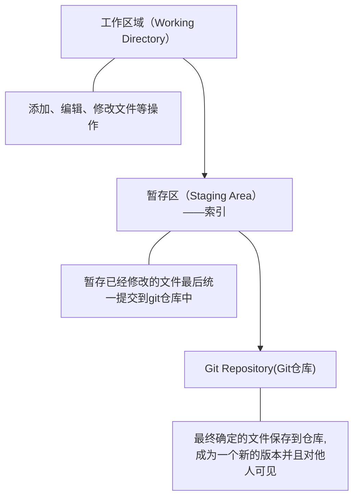
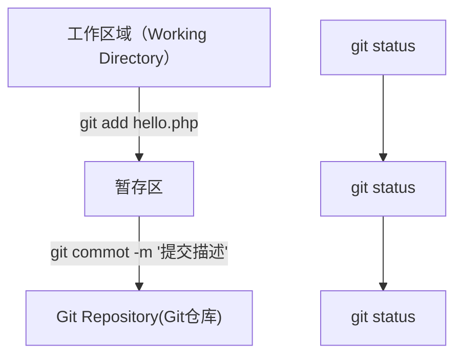

# Git

## 下载和安装

下载地址：https://git-scm.com/download/win

安装参考链接：自行搜索

## Git基本工作流程

### Git工作区域





### 第一步 初始化基本信息

```python
#1.设置用户名
git config --global user.name 'itcast'

#2.设置用户名邮箱
git config --global user.name 'itcast@qq.com'

#3.查看设置
git config --list

  git config --global user.email "you@example.com"
  git config --global user.name "Your Name"


```

### 第二步 初始化一个新的Git仓库

1. 创建文件夹

   ```python
   mkdir test
   ```

   

2. 在文件夹创建git仓库

   ```python 
   cd test
   git init
   ```

   > 会生成**.git**文件如果看不见则设置电脑显示隐藏文件

3. 向仓库添加文件

   ```python
   touch a1.php
   
   git status
   
   #添加到暂存区
   git add a1.php
   
   git status
   
   #将文件从暂存区提交到仓库
   git commoy -m 'add a1.php'
   
   git status
   ```

4. 修改仓库文件

   ```python
   git add a1.php
   
   git status
   
   git commit -m 'edit a1.php'
   
   git status
   ```

   

5. 删除仓库文件

   ```python
   #删除文件
   rm test.php
   
   #从Git中删除文件
   git rm test.php
   
   #提交操作
   git commit -m '提交描述'
   ```

### 第三步 将本地仓库同步到git远程仓库

1. Git克隆操作

   ```python
   git clone 仓库地址
   ```

   多学一招：仓库地址由来，Clone to clipboard

2. 将本地仓库同步到git远程仓库中

   ```python
   git push
   ```

   注：思考无法同步

## 分支

1.建立

```python
#1.建立 feature1 分支
git branch feature1
#2.查看分支
git branch
#3.切换分支到 feature1
git checkout feature1
```


## HTTPS & SSH & GitHub CLI

### https方式：

每次push（提交）都需要验证用户名和密码。

### ssh方式：

首先你必须是该项目的管理者或拥有者，并且需要配置个人的ssh key下。

```python
#1.生成SSH KEY
ssh-keygen -t rsa -C "yourmail@gmail.com"
#2.SSH KEY位置
cd ~/.ssh 
ls
#.pub是公钥
```

多ssh key管理请参考[Git安装及SSH Key管理之Windows篇](https://www.cnblogs.com/Gent-Wang/p/7422433.html)

### GitHub CLI：

第一方命令行工具，可以通过命令行与GitHub对接。[参考链接](https://cli.github.com/manual/)

## 

## Git之代理：

```python
git config --global http.proxy 'socks5://127.0.0.1:1080' 

git config --global https.proxy 'socks5://127.0.0.1:1080'
```

### github的代理(含取消代理)

```python
#只对github.com
git config --global http.https://github.com.proxy socks5://127.0.0.1:1080

#取消代理
git config --global --unset http.https://github.com.proxy
```

查看配置

```python
cat ~/.gitconfig
```

## Git之撤销

注：提交到远程仓库，不可逆。

### 1.撤销/丢弃最近修改

| 是否暂存区 | 是否远程仓库 | 命令                       | 描述                               |
| ---------- | ------------ | -------------------------- | ---------------------------------- |
| 否         | 否           | git checkout -- readme.txt | 撤销文件`readme.txt`修改           |
| 是         | 否           | git checkout -- readme.txt | 撤销修改就回到添加到暂存区后的状态 |

回到最近一次`git commit`或`git add`

```python
git checkout -- readme.txt
```

### 2.撤销暂存区修改

| 是否暂存区 | 是否远程仓库 | 命令（注意大写）                          | 描述                                           |
| ---------- | ------------ | ----------------------------------------- | ---------------------------------------------- |
| 是         | 否           | git reset HEAD readme.txt<br />git status | 暂存区的修改回退到工作区<br />撤销暂存区的修改 |

## Git之版本回退

| 命令                    | 工作区 | 暂存区 | 描述                                                         |
| ----------------------- | ------ | ------ | ------------------------------------------------------------ |
| git reset –-soft HEAD^  | 已修改 | 已修改 | 只回退了commit提交                                           |
| git reset --mixed HEAD^ | 已修改 | 未修改 | 回退了add和commit**默认**                                    |
| git reset -–hard HEAD^  | 未修改 | 未修改 | 彻底回退到某个版本<br />**一定要小心**<br />提交的修改和本地文件的修改都会被清楚 |
| git revert <commit>     |        |        | 产生一个新的commit<br />将回退作为一次修改记录提交<br />**好处是不修改历史提交记录** |

## Git之删除

1.当需要删除暂存区或分支上的文件，**同时工作区不需要这个文件**

这个文件没了

```python
git rm fileName
```

2.当需要删除暂存区或分支上的文件，**同时工作区需要这个文件，但是不需要被版本控制**

这个文件不在暂存区了，工作区还有

```python
git rm --cache fileName
```


# CMD命令

## 常用命令

ls——当前文件

pwd——当前工作目录

mkdir test——新建文件夹test

cd test——进入文件夹test

touch a1.php——新建a1.php文件

git add a1.php——添加到暂存区a1.php

git commoy -m 'add a1.php'——提交a1.php到仓库，备注'add a1.php'

git status——查看当前状态

cls——cmd清屏

clear——git清屏

..——返回上一级

## CMD命令之vi操作文件

vi a1.php——编辑a1.php文件

i/insert——输入内容

esc——退出输入

:w——保存

:q——退出vi

:wq——保存并退出文件

:set nu——显示行号

:set nonu——取消行号


# Git命令

## Git常用命令

| 命令                                                         | 用途                                                         |
| ------------------------------------------------------------ | ------------------------------------------------------------ |
| git version                                                  | git版本                                                      |
| git config --global user.name 'itcast'                       | 配置git的用户名为‘itcast’<br />**--global是全局参数**        |
| git config --global user.email 'itcast@qq.com'               | 配置git的邮箱为'itcast@qq.com'                               |
| cat ~/.gitconfig                                             | 查看目前的配置                                               |
| git log                                                      | 历史记录                                                     |
| git reflog                                                   | 记录每一次命令                                               |
| git init                                                     | 初始化git仓库<br />**默认master分支**                        |
| git status                                                   | git仓库状态                                                  |
| git add “README.md”                                          | 添加“README.md”到暂存区                                      |
| git add -A                                                   | 添加git目录所有文件到暂存区                                  |
| git rm “README.md”                                           | 删除暂存区或分支上的文件<br />**同时工作区不需要这个文件**   |
| git rm --cache “README.md”                                   | 删除暂存区或分支上的文件<br />**同时工作区需要这个文件，但是不需要被版本控制** |
| git commit -m "add README.md"                                | 提交暂存区文件到git本地仓库                                  |
| git remote add origin https://github.com/Zero-three/Test.git | 添加远程仓库https://github.com/Zero-three/Test<br />**origin远程仓库名** |
| git remote -v                                                | 所有远程仓库                                                 |
| git push origin master                                       | 推送本地git仓库到远程仓库                                    |
| git push origin master -u                                    | 记录`远程仓库名`和`分支`<br />之后只用`git push`即可提交     |
| git clone https://github.com/Zero-three/Test.git             | 将远程仓库代码克隆到本地                                     |
| git clone https://github.com/Zero-three/Test.git test-demo   | 将远程仓库代码克隆到本地目录的test-demo文件夹下              |
| git pull                                                     | 拉去远程仓库代码                                             |


## Git简称

| 命令     | 命令简称 | git命令                               |
| -------- | -------- | ------------------------------------- |
| status   | st       | git config --global alias.st status   |
| checkout | co       | git config --global alias.co checkout |
| commit   | ci       | git config --global alias.ci commit   |
| branch   | br       | git config --global alias.br branch   |
|          |          |                                       |
|          |          |                                       |
|          |          |                                       |
|          |          |                                       |
|          |          |                                       |

## Git小技巧